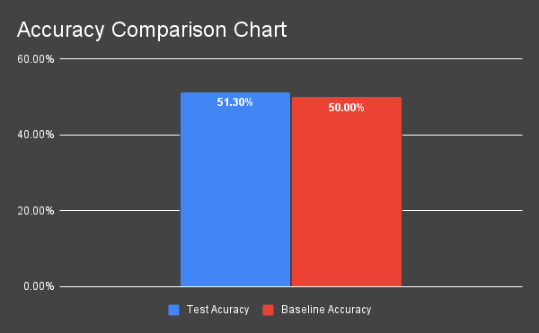

# p300 Speller Application
By: Thomas Blalock 
Date: December 6, 2023 
## Summary
Brain-Computer Interfaces (BCIs) are devices that read electrical signals from someone's brain. This project uses a electroencephalography (EEG) BCI to create an end-to-end application that enables people to communicate by looking at keys on a keyboard. This repository includes code for each step of the process, including networking with the BCI device, a GUI for the user to interact with the program, and a backend neural network-based function that translates the electrical signals from the EEG  into actionable commands.
## Table of Contents
1. [QuickStart](#quickstart)
2. [Introduction](#introduction)
3. [Hardware Setup](#hardware-setup)
4. [Hardware-Software Integration](#hardware-software-integration)
5. [Stimulus-Producing Software](#stimulus-producing-software)
6. [Data Collection](#data-collection)
7. [Data Preprocessing](data-preprocessing)
8. [Data Loading](#data-loading)
9. [Model Development](#model-development)
10. [Model Training](#model-training)
11. [Results](#model)
12. [Next Steps](#next-steps)
13. [References](#references)

## QuickStart
The following steps detail how to use this system.
1. Buy the OpenBCI Cyton board and electrodes or other hardware
If you chose to use different hardware, then you can still use this codebase by modifying the 'Board' object to work with your hardware API.
2. Assemble your hardware
In this project, I used 8 electrodes. Based on my research, I recommend using at least 16. Assemble the system so that wires from different electrodes are orthoganal to each other to minimize cross-contamination.
3. Open 'p300_bci_speller.ipynb' and run each code block in order.
This file is self-contained. You could download only this file and system will work as expected.

## Introduction
A brain-computer interface (BCI) reads and interprets the electromagnetic fields created by neural activity. This project employs a specific type of non-invasive BCI called electroencephalography (EEG), which reads electrical signals using electrodes that sit on a person's scalp. this project seeks to create a system called a speller application to enable people to communicate without any motor movement. Different BCI spellers utilize different signals in the brain. These various strategies for speller applications are referred to as speller paradigms. We employ the p300 speller paradigm, which utilizes the p300 novelty response in the brain that can be triggered by flashing colors as well as a digital keyboard that flashes in different patterns to determine what a subject is looking at. On the back-end, a classification model parses the data to determine if the p300 response is present. Significant noise is introduced in EEG systems, originating from other processes in the brain, the environment, and other processes in the body, such as blinking. Every part of this system pipeline can be optimized. The quality of the stimulus-producing software determines the size of the p300 response. The quality of data cleaning and feature extraction could determine if the model converges.

## Hardware Setup
In this project, we used a 3D-printed plastic frame with eight OpenBCI electrodes and an OpenBCI Cyton Board. The electrodes were placed in the p300 configuration found at this [link](https://www.researchgate.net/figure/Common-electrode-setup-for-P300-spellers-according-to-8-Eight-EEG-electrodes-are_fig1_221583051#:~:text=Eight%20EEG%20electrodes%20are%20placed,is%20attached%20to%20the%20rig). The wires were oriented orthogonal to each other to minimize cross-contamination.  

## Hardware-Software Integration
The software generated to interact with the helmet assumes that the helmet transmits the signal to the computer through a USB port. Since only one process can access a USB port at a time, our scripts and the OpenBCI GUI cannot be running at the same time. A 'Board' object was created to handle all interactions with the EEG helmet. The code is modular enough to that it would be very easy to change the script to receive the signal over wifi rather than the USB port.
## Stimulus-Producing Software
The end goal is to have a QWERTY keyboard that utilizes a binary search with the p300 responses to find the letter that a subject is looking at. It was determined that the machine learning model would converge more quickly if it was first trained on a more prominent p300 signal and then trained on the QWERTY keyboard. There are two GUI objects that flash different colors to stimulate the P300 response. The first version flashes different-sized boxes while the second version performs the binary search using a QWERTY keyboard with some non-letter values.
### Box GUI
The first GUI is just a flashing box. It is designed to elicit a strong p300 response. The data collected using this GUI was used to pretrain the model. The model will theoretically converge faster on a dataset with a more pronounced loss landscape. The GUI enables the user to specify differently sized and shaped box. This variation allows the user to vary the size of the p300 response since the size of the flashing box will likely correlate to the size of the p300 response. Multiple colors flash during a single sample. The colors and time between flashes are randomized to maximize the p300 response. The user controls the GUI by pressing any button to start a session and pressing any button to end the session. ([Video](https://drive.google.com/file/d/1brNTBQcGMbgrEQF33VNOBr9gMR-FDrz7/view?usp=sharing))

### Keyboard GUI
The other GUI is a QWERTY keyboard that performs a binary search to locate the letter a subject is looking at. Multiple colors flash during a single sample. The colors and time between flashes are randomized to maximize the p300 response. The user controls the GUI by pressing any button to start a session and pressing any button to end the session. ([Video](https://drive.google.com/file/d/1wZ7NQlmVvDv15T8Jm3jSL8A5N5WPvMQe/view?usp=sharing))

## Data Collection
Data collection was handled using a separate object named 'DataAcquisitionHandler'. This object has methods to collect data using both the box GUI and the keyboard GUI. It contains a 'Board' object and stores all the data internally. 

The following code blocks run the scripts to collect data. Each session of data is attached to an unstructured description to allow the user to specify anything notable about the data collection session, such as environmental conditions, electrical impedance, and factors about the subject that would affect their neurochemistry like hours of sleep. The code below is in 'simulation' mode so that it can be run without the Cyton board. The GUIs are controlled by pressing any key to start and pressing any key to end a session.<be>

The box GUI features flashing boxes in the middle of the screen. The user specifies the size of the box as an argument in the 'run_data_trial_box()' method. Whether or not the GUI flashes is randomized, meaning that a user might have to wait through several negative sample collections before they see the screen flash. After collecting the data, the entire 'DataAcquisitionHandler' object is printed to file using the 'pickle' library. These files will be read and the data preprocessed later in the process. 

The keyboard GUI features a QWERTY keyboard which performs a binary search to locate the letter a subject is looking at. During data collection, the target letter is randomized and displayed by the GUI at the bottom left corner of the frame. 

These GUIs produce the p300 stimulus when they flash. The randomization of the colors, the time intervals, and if the GUI flashes maximizes the p300 response since the subject cannot predict or expect certain stimuli with precision. The colors were selected to maximize the flashes' contrast with the background. 

### Data Collection for Curriculum Training
Designing two different methods to elicit the p300 response serves to enable the machine learning model to converge faster. Theoretically, the more pronounced the p300 response is in the data, the easier it will be for the model to identify it. Interpreted another way, the loss landscape for data with a more pronounced p300 response is less complex than it would be otherwise, meaning that the model would be less likely to get stuck in an unusable local minimum during training. An acceptable local minimum for this 'easy' dataset would likely be close enough to an acceptable local minimum for the 'harder' dataset. Thus, pretraining the model on the 'easy' dataset would enable the model to converge much faster on the 'hard' dataset. In this context, the 'easy' dataset includes samples gathered from the box GUI since having the entire screen flash takes up more visual space---and thus more cognitive space---than flashing a key on a QWERTY keyboard. The 'hard' dataset is composed of samples collected from the QWERTY keyboard. This process of pretraining on an 'easy' dataset before training the model directly on your real objective is referred to as 'curriculum training'.
## Data Preprocessing
Similarly to all electrical signals data, EEG data is extremely messy. In this project, the following cleaning methods were implemented to filter out extraneous data and help the model converge: 
- Common Averaging 
- Bandpass Filtering 
- Signals Smoothing

### Common Averaging
Variations in the placement of the helmet, electrical impedance, and numerous other factors can influence the average numeric value of a signal. Furthermore, the size of the p300 response can vary. These differences in magnitude among samples often hurt machine learning models' performances. This project normalizes the data using common averaging. Thus, data is generally normalized prior to training a model.

### Bandpass Filtering
The p300 stimulus response only occurs between 0.1 Hz and 30 Hz. Thus, every signal outside of that frequency range is noise and should be removed using a bandpass filter. 

### Signals Smoothing
Signals data is plagued with random surges and irregular spikes that can drown out the desired signal. Smoothing the signal suppresses this randomness leaving only the longer trends. The p300 should yield a longer trend than background neural processes. This project smooths the data to suppress that background noise so it does not overwhelm the machine learning model.

## Data Loading
Although this project's method of collecting data makes it likely that the data will have almost as many samples of each class, it does not guarantee it. If a machine learning model is trained on a dataset with too many of one class, it will learn to always predict that class. To avoid this, we balance the dataset. There are two main methods of balancing datasets. The first is to augment the under-represented class by duplicating samples or adding transformed samples. The second method is to 'downsample', which means to remove samples of the over-represented class until the dataset contains equal numbers of each class. In this project, we downsample the dataset since it is more costly to transform the dataset with augmentations than it is to just collect more data. Thus, we will have an abundance of data and can afford to downsample.

## Model Development
The first model trained in this project was a simple convolutional neural network with five one-dimensional convolutional layers and two dense layers. The network is sized to receive an input of 250 observations, which includes readings from the start of the stimulus to roughly 250 milliseconds past the surfacing of the p300 response. Batch normalization was applied to each of the convolutional layers to minimize overfitting. An Exponential Linear Unit (ELU) activation function was used to introduce non-linearity. This activation function selection was based on experimental results from the [Universal Joint Feature Extraction for P300 EEG Classification Using Multi-Task Autoencoder](https://github.com/IoBT-VISTEC/Pre-trained-EEG-for-Deep-Learning) project.

## Model Training
The Universal Joint Feature Extraction for P300 EEG Classification Using Multi-Task Autoencoder project also used the 'Adam' optimizer, which dynamically adjusts learning rates. It handles sparse gradients on noisy problems, like signals regression, very well. This project used 'Binary Cross Entropy Loss' as the loss function. This is the standard choice of loss function for binary classification problems.

## Results
Overall, roughly 3,000 samples of data were collected. These samples were collected in optimal conditions in locations and times with no periphery stimulus-producing distractions and no extraneous electrical signals. The first iteration of a classification model (EEG_Net_CNN) did not perform well enough for use in a speller application. The model was initially trained on unnormalized data and did not achieve a usable accuracy. The model was then retrained on fully preprocessed data. It achieved a better yet still unusable accuracy of 53.62%. A column chart comparing the baseline accuracy to the EEG_Net_CNN's accuracy is provided below:
  

## Next Steps
There is one main shortcoming in this project: the classification model's performance. This can be due to one or more of three factors:
- The quality and size of the training dataset.
- The quality of the data preprocessing.
- The architecture and training algorithm of the model.

### Dataset
Great pains were taken to optimize the p300 response and to ensure that all data collected was of good quality. Furthermore, 3,000 samples of data would be enough to fully train a small classification network like the EEG_Net_CNN. However, if the size of the neural network is increased, then more samples will need to be collected.
### Data Preprocessing
All the applied data preprocessing steps are generally needed for the neural network to converge quickly with signals data. Thus, none of the current preprocessing steps should be removed. However, the bandpass filter currently allows too much noise to filter through. The high frequency will be optimized further to reduce noise. Additionally, autoencoders are commonly used to extract features from signals data. An autoencoder will be trained and used to extract latent representations for further processing.
### Model
The simple CNN was unable to parse the EEG data. Before trying different model architectures, we will tune our current model to increase its accuracy. CNNs have been successful in classifying EEG data for speller applications in the past. This means that an optimal size and optimal hyperparameters would likely enable our model to perform well. Recurrent neural networks (RNNs) have also been made to perform well on EEG data in the past. Because everybody's brain operates differently, each brain has a different baseline. Perhaps, a RNN can learn how to characterize a specific person's neural patterns in its hidden state. After optimizing the CNN, we will wrap the CNN with a LSTM RNN to test if a hidden state increases accuracy. Lastly, other neural networks have been trained on EEG data to detect the p300 stimulus response. Finding a pretrained model and modifying that model with additional layers for transfer learning could yield a usable model faster than building a network from scratch.

